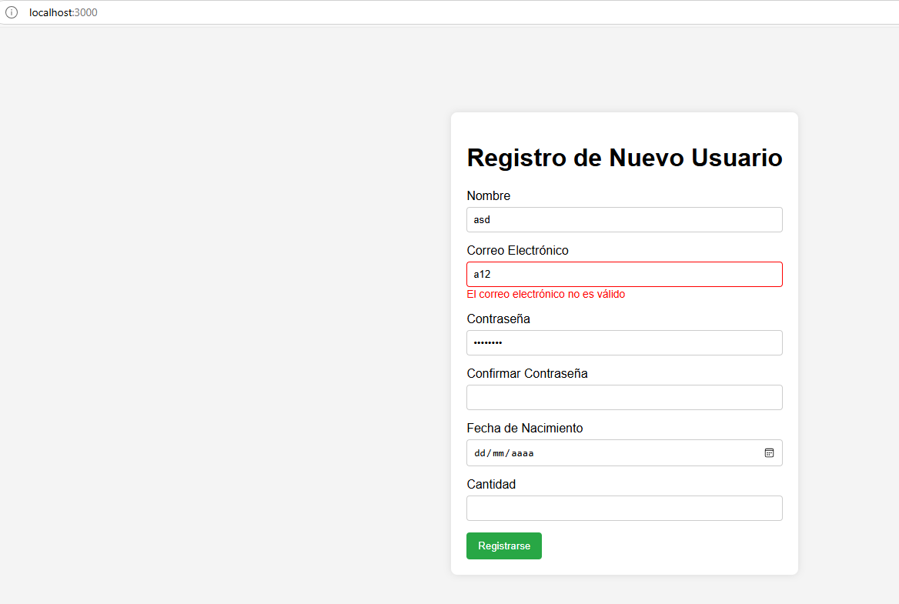
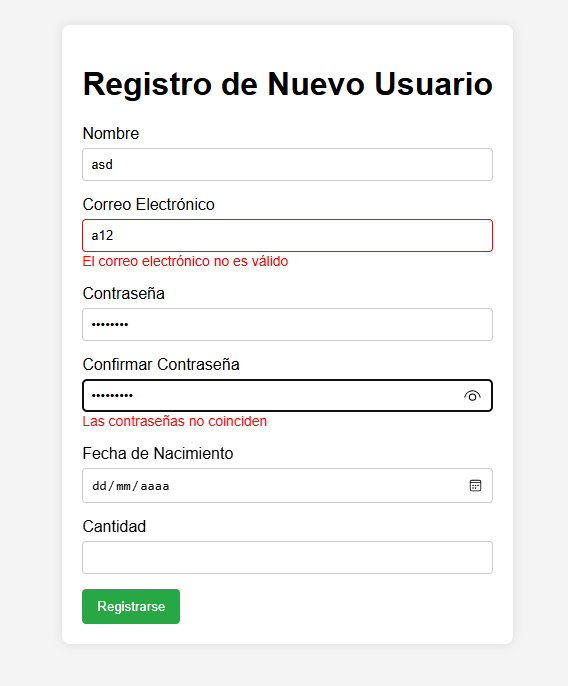
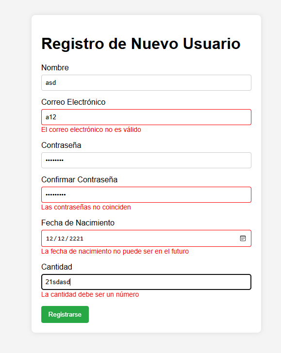
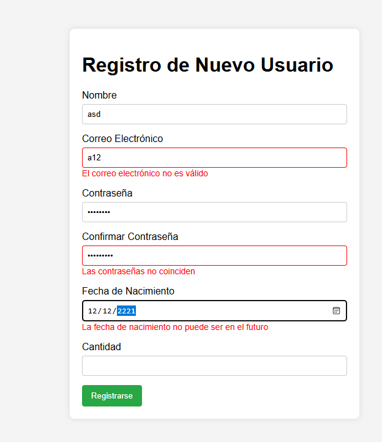

Validador de Formularios Dinámico
Este proyecto es un validador de formularios dinámico desarrollado en React con TypeScript. Su propósito es validar en tiempo real los datos ingresados por el usuario en un formulario de registro, proporcionando retroalimentación inmediata sobre los errores y asegurando que los datos sean correctos antes de ser enviados.

Tecnologías Usadas
React: Biblioteca de JavaScript para construir interfaces de usuario.

TypeScript: Lenguaje que añade tipos estáticos a JavaScript, mejorando la calidad y mantenibilidad del código.

HTML/CSS: Para la estructura y estilos del formulario.

React Hooks: useState para manejar el estado del formulario y los errores.

Validaciones Dinámicas: Implementadas en tiempo real usando expresiones regulares y lógica de JavaScript.

Implementación de Validaciones
El formulario incluye validaciones en tiempo real para los siguientes campos:

Nombre: Campo obligatorio.

Correo Electrónico: Debe tener un formato válido (ejemplo: usuario@dominio.com).

Contraseña: Debe tener al menos 8 caracteres.

Confirmar Contraseña: Debe coincidir con la contraseña ingresada.

Fecha de Nacimiento: Debe ser una fecha válida y no puede ser en el futuro.

Cantidad: Debe ser un número válido.

Las validaciones se implementaron utilizando:

Expresiones Regulares: Para validar el formato del correo electrónico.

Lógica de JavaScript: Para comparar contraseñas, verificar fechas y asegurar que los campos obligatorios no estén vacíos.

Manejo de Estado: Usando useState para almacenar los valores del formulario y los mensajes de error.

Capturas de Pantalla
1. Formulario Vacío

2. Validación en Tiempo Real

3. Formulario con Errores

Desafíos y Soluciones
Desafío 1: Validación en Tiempo Real
Problema: Implementar validaciones en tiempo real sin afectar el rendimiento.

Solución: Usar el evento onChange para validar cada campo mientras el usuario escribe, y actualizar el estado de los errores solo cuando sea necesario.

Desafío 2: Manejo de Tipos en TypeScript
Problema: TypeScript arrojaba errores al acceder a propiedades dinámicas de un objeto.

Solución: Definir un tipo (FormFields) para las claves del formulario y usar aserciones de tipo (as) para asegurar que las claves sean válidas.

Desafío 3: Validación de Fechas
Problema: Validar que la fecha de nacimiento no sea en el futuro.

Solución: Comparar la fecha ingresada con la fecha actual usando new Date().

Instalación y Ejecución
Sigue estos pasos para instalar y ejecutar el proyecto en tu máquina local.

Requisitos Previos
Node.js: Asegúrate de tener Node.js instalado. Puedes descargarlo aquí.

npm: Viene incluido con Node.js.

Pasos para Instalar
Clona el repositorio:

bash
Copy
git clone https://github.com/elson0652/validador.git 
Navega al directorio del proyecto:

bash
Copy
cd validador-formularios
Instala las dependencias:

bash
Copy
npm install
Pasos para Ejecutar
Inicia el servidor de desarrollo:

bash
Copy
npm start
Abre tu navegador y visita:

Copy
http://localhost:3000
Estructura del Proyecto
Copy
validador-formularios/
│
├── src/
│   ├── components/
│   │   ├── FormInput.tsx
│   │   └── FormValidator.tsx
│   ├── App.tsx
│   ├── index.tsx
│   └── styles.css
│
├── public/
│   └── index.html
│
├── package.json
├── tsconfig.json
└── README.md
Contribuciones
¡Las contribuciones son bienvenidas! Si encuentras algún error o tienes una sugerencia, abre un issue o envía un pull request.

Licencia
Este proyecto está bajo la licencia MIT. Para más detalles, consulta el archivo LICENSE.

Contacto
Si tienes alguna pregunta o comentario, no dudes en contactarme:

Nombre: Jhonathan Zubieta

Email: [angels1203@outlook.es]

GitHub: tu-usuario

¡Gracias por visitar este repositorio! Espero que este proyecto te sea útil
